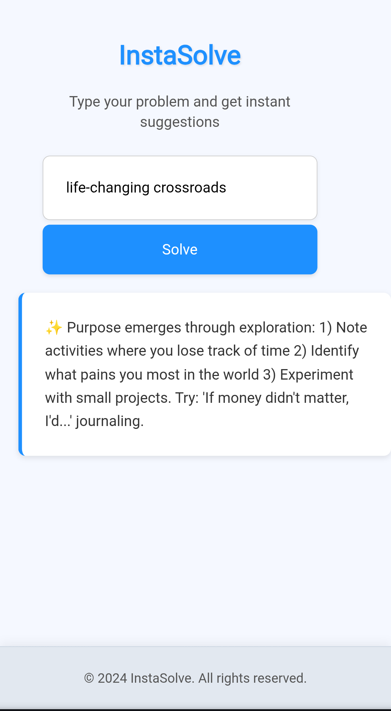

# InstaSolve

A lightweight, one-page web app that gives instant, actionable tips for any problem you describe.  
Built for the Redmond Library Hackathon 2025.

## 🚀 Features
- Single input box for user problems
- Instant themed tips & solutions
- Fully responsive and mobile-friendly
- Works offline (no backend required)

## 📸 Demo

##Video: https://youtube.com/shorts/OMWSInREdF8?feature=share

## 🛠 Tech Stack
- HTML
- CSS
- JavaScript

## 🎯 How to Use
1. Open `index.html` in your browser.
2. Type your problem in the input box.
3. Click **Solve** to get instant tips.

## 📌 Future Scope
- Connect to AI APIs for dynamic answers
- Add theme-specific datasets
- User accounts & personalization

## 📄 License
This project is licensed under the MIT License.
